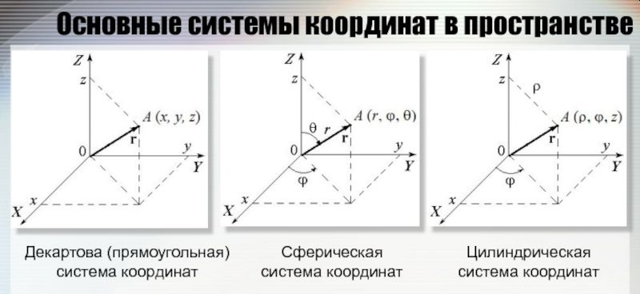
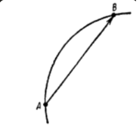
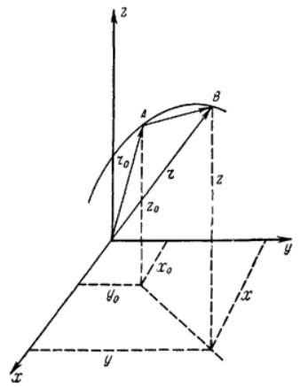
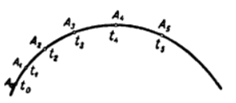
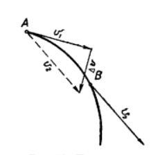

# 2. Кинематика
## __ОСНОВНЫЕ ПОНЯТИЯ КИНЕМАТИКИ__
__Кинематикой__ называется раздел механики, изучающий перемещение тел без учета взаимодействий между ними. Кинематика ограничивается разработкой способов описания движения тел, отказываясь от выяснения причин, которые изменяют состояние движения. 

Все изменения в окружающем нас мире происходят в известной последовательности, обладают большей или меньшей длительностью. Ни одно явление не может произойти мгновенно. Непрерывное и бесконечное развитие материи проявляется во времени.

__Время__ — форма существования материи. Говоря «прошло столько-то времени — день, год, два...», мы тем самым отмечаем какое-то событие или явление как начало счета времени и выделяем последовательность изменений, происшедших после него в природе, в обществе или в жизни отдельного человека. Если бы перестали про- исходить изменения в окружающем мире, время остановилось бы, оно попросту перестало бы существовать. Более того, современная физика доказала, что длительность процессов, протекающих в теле, зависит от скорости его движения. Продолжительность процессов, которая определяет интервалы времени, меняется с изменением скорости тела. 

Развитие материи происходит не только во времени, но и в пространстве. Все материальные тела обладают пространственной протяженностью, каким-то образом расположены друг относительно друга. Два тела не могут одновременно находиться в одном и том же месте. В процессе развития меняется и взаимное расположение тел, и их протяженность. Пространство, как и время, есть форма существования материи. 

Для раскрытия наиболее общих кинематических особенностей движения тела мы прибегаем к изображению тел отсчета в виде некоторой геометрической абстракции, отвлекаясь от их конкретных свойств. 

Для движений, которые изучаются так называемой «классической» механикой пространство можно считать однородным (одинаковым во всех своих, частях) и изотропным (со свойствами, не зависящими от направления). Математически такое пространство может быть описано геометрией Евклида. 

В однородном и изотропном пространстве в качестве абстракции тел отсчета может быть принята система трех взаимно перпендикулярных плоскостей. Такую геометрическую абстракцию называют системой отсчета или системой координат. Три взаимно перпендикулярные Прямые, образованные пересечением плоскостей и связанные с телом отсчета, называют декартовыми осями координат. Для изучения движений в выбранной системе отсчета мы должны располагать способами измерения расстояний и времени. При этом способы измерения длин и времени должны быть пригодны для измерений как в системе неподвижных тел, так и движущихся друг относительно друга. 

## __ДВИЖЕНИЕ МАТЕРИАЛЬНОЙ ТОЧКИ. ВЕКТОР ПЕРЕМЕЩЕНИЯ__
__Материальной точкой__ называют абстракцию реального тела, которое в данной задаче может рассматриваться как геометрическая точка, обладающая массой, равной массе тела. Тело можно принять за материальную точку, если все его части перемещаются практически одинаковым образом и расстояния, проходимые телом, велики по сравнению с его размерами. Например, изучая движение планет по орбитам вокруг Солнца, мы можем принять их за материальные точки. 

Линия, которую описывает материальная точка, перемещаясь в пространстве, называется __траекторией__. Если траектория — прямая линия, то движение называют прямолинейным, если точка движется по более сложной линии (окружность, парабола, любая произвольная кривая), движение называют криволинейным. 

Зафиксируем положение A материальной точки на траектории для момента времени $t_0$ , принятого за начальный (рис. 1). Пусть за интервал времени t — $t_0$ точка переместилась из положения А в положение В. Отрезок прямой, имеющий длину АВ и направленный от A к В, называется __перемещением точки__.

(Рис 1).

Отрезок $\overrightarrow{AB}$ называется __вектором перемещения__. 

__В пределе при бесконечно малом интервале времени dt бесконечно малый вектор перемещения ds сливается с бесконечно малым отрезком траектории.__ 

(Рис 2).

Как известно из векторной алгебры, вектор может быть определен тремя составляющими по осям координат. Если вектор перемещения $\overrightarrow{Δs}$ образует с осями координат углы α, β, γ, то его составляющие по осям (рис 2): 

$Δs_x = Δscosα$; $Δs_y = Δscosβ$; $Δs_z = Δscosγ$; 

$$Δs=\sqrt{Δs_x^2+Δs_y^2+Δs_z^2}$$

Положение точки может быть определено радиусом-вектором, проведенным к ней из некоторой фиксированной точки, принятой за полюс. Положим, полюс совпадает с началом координат нашей системы отсчета. Тогда положение А точки на траектории в начальный момент времени $t_0$ будет определено радиусом-вектором $\overrightarrow{r_0}$. Пусть к моменту t точка переместилась в положение В, радиус-вектор которого обозначим $\overrightarrow{r}$. Как легко видеть из чертежа, вектор перемещения $\overrightarrow{AB}$ = $\overrightarrow{Δs}$ равен разности радиусов-векторов $\overrightarrow{r}$ и $\overrightarrow{r_0}$.
$$\overrightarrow{Δs} = \overrightarrow{r} -\overrightarrow{r_0}$$

__Бесконечно малое перемещение равно приращению расстояния за бесконечно малый интервал времени.__ 

## __Скорость__
Если при движении точки расстояние в одинаковые произвольно выбранные промежутки времени получает одинаковые приращения, то движение называется равномерным (независимо от того, происходит ли оно по криволинейной или прямолинейной траектории). Если приращения расстояния в равные промежутки времени неодинаковы, движение называется неравномерным. 

Положим, точка движется вдоль плоской кривой (рис 3)

(Рис 3)

В некоторый момент времени $t_0$, который мы принимаем за начальный, точка находилась в положении $А_о$. Измерим расстояния, которые она прошла к соответствующим моментам времени $t_1$, $t_2$, $t_3$, $t_4$, $t_5$. По найденным значениям времени и расстояний s построим график зависимости расстояния s от времени t. Этот график носит название графика расстояний (рис 4). 

(Рис 4)

Разобьем интервал времени от t = 0 до t = $t_5$ 
на равные промежутки Δt. На рисунке легко видеть, что приращения Δs, соответствующие одной и той же величине промежутка времени Δt, в начале и в конце интервала различны, т. е. движение точки неравномерно. 

Быстроту, с которой материальная точка движется в пределах каждого промежутка времени,
характеризует расстояние, проходимое точкой за единицу времени. Эту физическую величину называют скоростью. При равномерном движении скорость постоянна во все время движения, при
неравномерном движении она со временем изменяется. Если мы наблюдаем движение в пределах
конечного промежутка времени Δt,то в его пределах быстрота движения характеризуется средней скоростью $\frac{Δs}{Δt}$, где Δs — приращение расстояния за время Δt.

__Алгебраическое значение мгновенной скорости равно величине производной от расстояния по времени.__ 

$$v=\lim\limits_{Δt \to 0 } \frac{Δs}{Δt}$$

Как известно, в математике такой предел вычисляется как производная от расстояния по времени: 
$$v=\frac{ds}{dt}$$

Скорость есть вектор $\overrightarrow{v}$, равный производной от вектора перемещения по времени и совпадающий с направлением касательной к траектории в данной точке. 
## __Ускорение__

Скорость механического движения в большинстве случаев не остается постоянной, а со временем меняется либо по величине, либо по направлению, либо и по величине, и по направлению одновременно. 

Примером движения с изменяющейся по величине скоростью может служить свободное падение тел на Землю, движение поезда, подходящего к станции на прямолинейном участке пути, и т. п. 

Равномерное обращение точки по окружности — пример движения, при котором скорость меняется только по направлению. 

Примеров, когда скорость меняется и по величине, и по направлению, можно привести множество: движение Земли по своей орбите, движение искусственных спутников Земли, падение парашютиста, движение точек автомобильного колеса при торможении, при повороте автомобиля и т. д. 

Пусть тело в момент $t_1$ двигалось со скоростью $\overrightarrow{v}$ а к моменту $t_2$ стало двигаться со скоростью $\overrightarrow{v_2}$ (рис 5). 

(Рис 5) 

Перенесем вектор $\overrightarrow{v_2}$ параллельно самому себе в начало вектора $\overrightarrow{v}$ Разность векторов $\overrightarrow{v_2}$ и $\overrightarrow{v}$ очевидно, и даст нам вектор приращения скорости: 

$$\overrightarrow{Δv} = \overrightarrow{v} - \overrightarrow{v_2}$$

Предел, к которому стремится отношение приращения скорости к соответствующему интервалу времени, когда последний неограниченно убывает, называется ускорением. 

$$a=\lim\limits_{Δt \to 0 } \frac{Δv}{Δt}$$

или

$$a=\frac{dv}{dt}$$

__Ускорение есть вектор, равный производной от вектора скорости по времени и совпадающий по направлению с вектором изменения скорости dv за малый интервал времени dt.__ 

## __ПРЯМОЛИНЕЙНОЕ ДВИЖЕНИЕ__
Движение называется прямолинейным и равномерным, если точка движется вдоль прямой с постоянной скоростью. В этом случае путь, расстояние и результирующее перемещение совпадают по величине, а расстояние, перемещение и скорость совпадают также и по направлению. Поскольку скорость постоянна, то движение может происходить по прямой только в одном направлении, так как для изменения направления на обратное скорость должна в некоторый, хотя бы малый, интервал времени измениться от + v до — v, пройдя через нуль. 

Если в начальный момент времени материальная точка находилась на прямой в положении, принятом за начало отсчета, т. е. L = 0 при t = 0, то 
$$v=\frac{L}{t}$$,
т. е. при равномерном движении путь и расстояние, пройденные точкой, есть линейные функции времени. 

В случае прямолинейного неравномерного движения траектория точки — прямая линия, вдоль которой в разные моменты времени она движется с различной скоростью. График расстояний представляет собой кривую, вид которой определяется видом функции s = 
= s(t). Движение с постоянным по величине и направлению ускорением называется равнопеременным движением. 
$$v=v_0+at_0$$
__При равнопеременном движении скорость линейно зависит от времени.__ 

__Расстояние, проходимое при равнопеременном движении, пропорционально квадрату времени.__ 
$$s=v_0t+\frac{at^2}{2}$$
