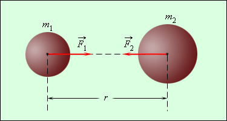

# __СИЛЫ ВСЕМИРНОГО ТЯГОТЕНИЯ__

ЗАКОН ВСЕМИРНОГО ТЯГОТЕНИЯ

В начале ХѴII в. Иоганн Кеплер (1571-1630) после двадцати- летней обработки данных наблюдений астронома Тихо Браге за движением планет установил законы их движения.

## __1-й закон.__
Планеты обращаются вокруг Солнца по плоским кривым, представляющим собой эллипсы, в одном из фокусов которых находится Солнце.

## 2-й закон
Радиус-вектор, проведенный от Солнца к планете, в равные времена описывает равные площади.

## 3-й закон
Квадраты времен обращения планет относятся как кубы больших полуосей их орбит.

Открытие законов Кеплера поставило определенную механическую задачу: найти силы, под действием которых совершается движение планет (как мы знаем, такого типа задача называется обратной
динамической задачей). Галилей, открыв закон инерции и установив независимость действия сил, дал начальные принципы, на основе которых эта задача могла быть решена. Гюйгенс, найдя выражение для центростремительной силы и решив ряд других динамических задач, дал примеры простейших приемов их решения. В 1666 г. итальянец Борелли высказал мысль, что движение планет есть результат «уравновешивания» некоторого естественного «стремления» небесных тел к соединению друг с другом (в данном случае Солнца и планеты) и обусловленного вращательным движением
«стремления» тел к движению от центра вращения. В период с 1666 по 1680 г. Гук в нескольких работах и письмах высказал (хотя и без доказательств) мысли об отклонении траекторий небесных тел от прямолинейных в результате действия сил:

_Все небесные тела притягивают к центрам не только свои части, как это мы наблюдали на Земле, но и другие небесные тела, находящиеся в сфере их действия; притяжение тел друг другом обратно пропорционально квадрату расстояния между ними._

### ___Между любыми двумя телами действует сила всемирного тяготения, пропорциональная массам тел и обратно пропорциональнальная квадрату расстояния между ними.___ 

 $$ F= γ( {m_{1}m_{2} /r^2}) $$

где m - массы взаимодействующих тел, r - расстояние между их центрами, γ коэффициент пропорциональности, называемый гравитационной постоянной (от латинского слова gravitasтяжесть).

В законе всемирного тяготения Ньютоном был обобщен ряд частных экспериментальных фактов (сравнение величины ускорений Луны и предметов у поверхности Земли, особенности движения пла-нет). Затем Ньютон показал, что в соответствии с теми же законами
Кеплера, а следовательно, под действием сил этого же типа движутся спутники планет Юпитера и Сатурна. Это позволило ему предположить, что закон тяготения обладает всеобщей применимостью.
Проверку этого предположения он произвел, исследовав движение комет, а также движение Луны вокруг Земли, осложненное влиянием на нее Солнца. Многочисленные приложения закона всемирного тяготения к задачам небесной механики показали его справедливость для взаимодействия звезд, планет, туманностей и других
небесных тел. Многочисленные проверки в земных условиях показали, что он справедлив для всех случаев взаимодействия тел.
Применяя закон всемирного тяготения, нельзя забывать, что он установлен для тел, принимаемых за материальные точки, т. е. для тел, размеры которых весьма малы по сравнению с расстоянием
между ними. Если расстояние между телами сравнимо с их размерами, то мы должны мысленно расчленить тела на малые элементы и найти ре- зультирующую силу тяготения между всеми попарно взятыми эле-
ментами. Это сложная математическая задача, методы решения которой разработаны математической физикой в так называемой теории потенциала.
Однако для расчета сил тяготения между двумя шарообразными однородными по плотности телами конечных размеров можно применить формулу (5.6), считая, что их масса сосредоточена в гео-
метрических центрах. То же допустимо, если плотность сферических тел меняется концентрическими слоями. На вопрос о происхождении сил тяготения физика пока не может дать ответа.

