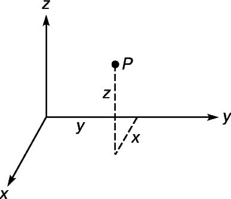

# __МЕХАНИЧЕСКИЕ СИСТЕМЫ__

## __МЕХАНИЧЕСКИЕ СИСТЕМЫ. ЦЕНТР МАСС__

До сих пор мы изучали взаимодействие двух тел и часто, рассматривая движение одного тела, заменяли другое, с которым первое взаимодействует, соответствующей силой. Но изучение законов
движения одного или двух тел не исчерпывает всех возможных задач о механическом движении, с которыми мы сталкиваемся при изучении природы или в технике. Нередко приходится иметь дело
с движением совокупности взаимодействующих между собой тел или с движением, как говорят, механической системы. Пример механических систем: любая машина, тепловоз с вагонами, Солнце
и планеты, ракетный поезд и т. п., а также любое тело, если в данной задаче его приходится рассматривать как совокупность частиц.
Если движение таково, что размеры и форма отдельных тел, образующих систему, не играют роли, то рассматривается задача о
движении системы материальных точек. Силы, действующие между телами системы, называются внутренними для данной системы силами, например сила взаимодействия ракеты и газов, силы взаимного тяготения планет и Солнца.
Силы, действующие на тела системы со стороны тел, не входящих в данную систему, называются внешними силами, например
сила притяжения к Земле, действующая на ракету и газы, сила сцепления колес трактора и плуга с Землей и т. п. Одна и та же сила в
зависимости от постановки задачи может быть внутренней или внешней. Силы взаимного притяжения планет и Солнца внутренние силы, если мы рассматриваем солнечную систему как целое, и внешние по отношению к каждой отдельно взятой планете, когда, скажем,
Мы решаем задачу о движении Земли и Луны, о приливных явлениях на поверхности Земли и т. п. Под воздействием сил каждая из материальных точек системы,
вообще говоря, как-то изменяет состояние своего движения, перемещаясь относительно других точек.

### __Центром масс двух материальных точек называется точка, делящая расстояние между ними в отношении, обратно пропорциональном их массам__

$$ (x_{2}-x)/(x-x_{1})=m_{1}/m_{2} $$

$$ (y_{2}-y)/(y-y_{1})=m_{1}/m_{2} $$

$$ (z_{2}-z)/(z-z_{1})=m_{1}/m_{2} $$

Решая данные неравенства относительно x,y,z получим:

$$ x=(m_{1}x_{1}+m_{2}x_{2})/(m_{1}+m_{2}) $$

$$ y=(m_{1}y_{1}+m_{2}y_{2})/(m_{1}+m_{2}) $$

$$ z=(m_{1}z_{1}+m_{2}z_{2})/(m_{1}+m_{2}) $$

### __Центром масс трех материальных точек называется точка, которая делит расстояние между центром масс двух из них и третьей точкой в отношении, обратно пропорциональном сумме масс двух первых точек и массе третьей из них__

Прибавляя к системе третью, четвертую, пятую и т.д. точки, получим, что координаты центра масс системы n материальных точек: 

 $$ x_{c}= \sum m_ix_i/\sum m_i $$ 

 $$ y_{c}= \sum m_iy_i/\sum m_i $$ 

 $$ z_{c}= \sum m_iz_i/\sum m_i $$ 

