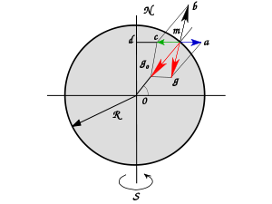

# __ОТНОСИТЕЛЬНОЕ ДВИЖЕНИЕ.__

 ## __ИНЕРЦИАЛЬНЫЕ СИСТЕМЫ. МЕХАНИЧЕСКИЙ ПРИНЦИП ОТНОСИТЕЛЬНОСТИ.__

Рассмотрим наиболее простой случай:
движение тела относительно равномерно и прямолинейно движущихся систем отсчета. На палубе равномерно и прямолинейно движущегося вдоль берега корабля перемещается известным образом тело. Различается ли (и как) его движение относительно системы отсчета, связанной с палубой корабля, и системы, связанной с Землей? 
Первую систему принято называть _«подвижной»_, вторую — _«неподвижной»_ или _«основной»_. Выбор той или иной системы в качестве неподвижной, конечно, условен, и с кинематической точки зрения любая из этих двух систем может быть принята за неподвижную. Однако в условиях нашей задачи именно корабль, а не берег — то тело отсчета, которое получает и расходует энергию для поддержания неизменным состояния механического движения. Естественно поэтому считать связанную с ним систему подвижной. 

Движение тела в подвижной системе отсчета (палуба корабля) называют _относительным движением_, а в условно неподвижной (линия берега) — _абсолютным движением_; наконец, движение тела относительно неподвижной системы отсчета, которым оно обладало бы, будучи жестко связано с одной из точек подвижной, называется _переносным_. 

Обозначим координаты точки в неподвижной системе x,y,z; ее координаты в подвижной системе x', y', z'. Положим, подвижная система перемещается прямолинейно относительно неподвижной с постоянной скоростью  V

Для простоты рассуждения будем считать, что в момент t=0 оси обеих систем отсчета совпадают и оси абсцисс направлены вдоль скорости V. Тогда в любой момент времени координаты движущейся точки в системах x, y, z и z', y', z' связаны соотношением: 
$$x= x'+x_0$$ 

$$ y=y' $$

$$ z=z' $$

$$ x_0 = V_0t $$

Эти соотношения называются _галилеевыми преобразованиями координат_. Они позволяют перейти от координат движущейся точки одной системе к ее координатам в другой системе, если системы движутся друг относительно друга равномерно и прямолинейно со скоростью V.

Чтобы найти связь между составляющими скоростей точки в той и другой системах (между составляющими скоростей абсолютного, относительного и переносного движений), надо продифференцировать выражения по времени. Так как x, y, z и z', y', z' - функции времени, а V от времени не зависит, то после дифференцирования получим: 

$$ V_x=V'_x+V_o $$

$$ V_y=V'_y $$ 

$$ V_z=V'_z $$ 

Продифференцировав по времени еще раз, получим связь между составляющими ускорения: 

$$ j_x=j'_x $$ 

$$ j_y=j'_y $$ 

$$ j_z=j'_z $$

1. Абсолютная скорость о движущейся точки равна векторной сумме относительной скорости и’ и переносной скорости че. 

2. Абсолютное ускорение равно относительному. Следовательно, ускорение одного и того же тела в каждый момент времени одинаково во всех системах отсчета, движущихся равномерно и прямолинейно друг относительно друга.

  Первый вывод вполне подтверждается нашим повседневным опытом. Например, абсолютная скорость перемещения человека, идущего по палубе движущегося вдоль берега парохода, складывается из относительной скорости перемещения человека по палубе и переносной скорости вместе с пароходом относительно берега. Второй вывод не так самоочевиден, но легко понять, что поскольку скорость движения парохода постоянна, то некоторое изменение скорости относительного движения человека вызовет такое же изменение его скорости в абсолютном движении.

  Во всех системах отсчета, перемещающихся друг относительно друга равномерно и прямолинейно, первый и второй законы Ньютона справедливы в полученных нами ранее формулировках. 

  Системы отсчета, движущиеся друг относительно друга равномерно и прямолинейно, называются инерциальными или галилеевыми. Как мы видели общий центр масс тел, образующих замкнутую систему, движется равномерно и прямолинейно. Следовательно, инерциальные системы отсчета связаны с телами отсчета (точнее, с центрами масс), образующими в данных условиях замкнутую систему. 

  Значение таких систем отсчета для изучения механического движения определяется тем, что в них ускорения тел однозначно определяются взанмодействиями между телами. В системе отсчета, движущейся ускоренно, тело, находящееся под действием сил, будет двигаться с ускорением, которое зависит не только от этого действия, но также и от ускорения системы отсчета.

