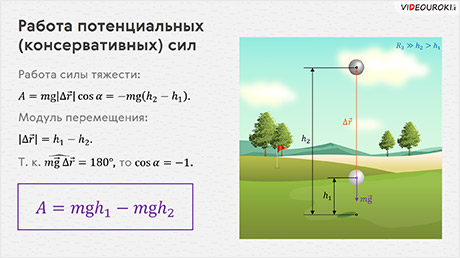

# __ЭНЕРГИЯ. РАБОТА. МОЩНОСТЬ.__

## __ЭНЕРГИЯ. РАБОТА.__

Допустим, два одинаковых шарика из пластилина движутся с равными по абсолютной величине скоростями навстречу друг другу. После столкновения шарики останавливаются. До удара они двигались, после удара покоятся. Закон сохранения количества движения при этом выполнен: до удара сумма количеств движения была равна нулю (mV - mV = 0) и после удара осталась равной нулю (m*0 + m*0 =0). Но до удара шары двигались, а после удара они неподвижны. Рассматривая количество движения как универсальную меру движения, мы должны были бы сделать ложный вывод об исчезновении движения, которым обладал каждый шар в отдельности, Однако если произвести измерение температуры шаров до и после столкновения, то можно обнаружить, что их температура в результате удара повысилась. Другими словами, механическое движение шаров не исчезло, а перешло в молекулярную форму движения вещества, из которого изготовлены шары. 

В результате трения механическое движение также «исчезает», переходя в теплоту. При вращении ротора электрического генератора механическое движение преобразуется в электромагнитное движение. Это преобразование легко показать на простом опыте. Положим, электрический генератор, в цепь которого включена электрическая лампа, приводится в действие падающей гирей. При разомкнутой цепи гиря движется с некоторой скоростью 1 под действием результирующей двух сил: тяжести и трения. Но стоит замкнуть электрическую цепь, как скорость падения гири уменьшается до и. Следовательно, часть механического движения действительно преобразуется в электромагнитное.

Быстро летящий электрон при известных условиях излучает свет и при этом тормозится и т. д. 

Механическое движение не исчезает, а переходит в эквивалентное количество других видов движения материн. Существенно важно то, что эти переходы осуществляются в строго определенных количественных соотношениях. Количественная определенность соблюдается и для любых других переходов одного вида движения материи в другой: теплового в механическое, электромагнитного в световое и т. д.

Естественно предлоложить, что должна существовать обща мера количества движения для всех видов движения матери, — Такая мера носит название энергии. ___Энергия есть универсаль ная мера количества любых видов движения материи.___ 

Весь опыт науки, обобщенный материалистической диалектикой, говорит, что материя и движение вечны и нерасторжимы. 

Единство матерни и движения нашло наиболее общее выражение в формуле Эйнштейна $E=c^2m$ где Е — энергия, m — масса, с — скорость света. Это соотношение говорит о том, что увеличение или уменьшение энергии, т. е. количества определенной формы движения, всегда происходит одновременно с увеличением или уменьшением массы, т. е. количества соответствующей формы материи. 

Состояние, в котором находится система тел, может быть определено заданием ряда величин. Чтобы описать состояние механического движения системы тел, достаточно знать их взаимное расположение и скорости; чтобы характеризовать состояние газа, надо указать его объем, давление и температуру ит. д. 

Величины, с помощью которых может быть полностью охарактеризовано состояние системы, называются параметрами. 

Поскольку энергия — мера движения, т. е. изменения состояния материальной снстемы, естественно предположить, что она может быть количественно выражена через параметры состояния, т. е. энергия есть функция состояния. 

Ниже мы получим количественное выражение энергии через характеристики состояния механического движения. Предварительно введем еще одно важное понятие — понятие работы. 

Обмен механическим движением между телами или переход механического движения в другие его формы происходит всегда в результате взаимодействия тел. Опыт показывает, что во всех процессах такого рода величина переданного движения пропорциональна произведению силы на величину перемещения. Количество теплоты, которое выделяется в результате падения камня с высоты А на Землю, прямо пропорционально произведенню величины силы тяжести на высоту; количество электричества, которое может быть получено на гидростанции, пропорционально произведению веса воды, падающей на лопатки турбины, на высоту падения воды (напор) ит. д.

